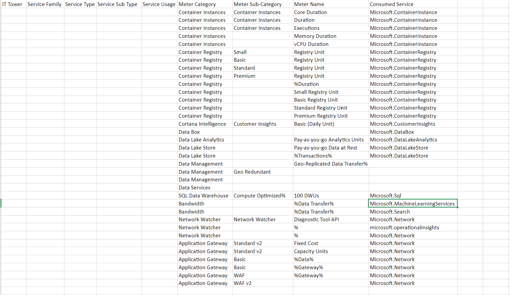
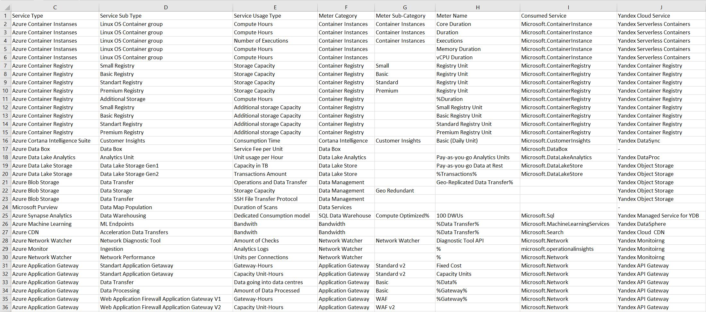

# Лабораторная работа по знакомству с облачными сервисами №2

## Состав команды
+ Белоус Ярослав(https://t.me/y0rikk) - **Капитан**
+ Райнус Анастасия (https://t.me/doriNasty) 
+ Иванова Анна (https://t.me/anuvaan) 
+ Ветошкин Ростислав (https://t.me/rost1kv)

## Цель работы:

Знакомство с облачными сервисами. Понимание уровней абстракции над инфраструктурой в облаке. Формирование понимания типов потребления сервисов в сервисной-модели. Сопоставление сервисов между разными провайдерами. Оценка возможностей миграции на отечественные сервисы.

## Дано
1. Слепок данных биллинга от провайдера после небольшой обработки в виде SQL-параметров. Символ % в начале/конце означает, что перед/после него может стоять любой набор символов.

2. Google с документациями провайдера

## Исходные данные

## Описание сервисов Azure

**Azure Container Instances**

Сервис для развертывания и управления контейнерами без предварительного создания и управления виртуальными машинами. Позволяет быстро развертывать контейнеры и масштабировать приложения.

**Azure Container Registry**

Реестр для хранения и управления контейнерами и образами Docker. Позволяет разработчикам хранить, управлять и развертывать контейнеры с высокой доступностью и безопасностью.

**Azure Cortana Intelligence**

Набор инструментов и служб для создания и развертывания интеллектуальных решений. Включает в себя возможности искусственного интеллекта, анализа больших данных и машинного обучения.

**Azure Data Box**

Устройство для физической миграции больших объемов данных в облако Azure. Обеспечивает быструю и безопасную передачу данных в облако.

**Azure Data Lake Analytics**

Сервис анализа больших данных, который позволяет выполнять сложные запросы и аналитику на больших объемах данных в хранилище данных Azure Data Lake Storage.

**Azure Data Lake Store**

Облачное хранилище данных для анализа больших объемов данных. Поддерживает разнообразные типы данных и обеспечивает высокую пропускную способность.

**Azure Data Management**

Набор служб для управления данными в облаке Azure. Включает в себя средства для интеграции, защиты и обеспечения доступности данных.

**Azure Data Services**

Полный спектр служб для работы с данными в облаке Azure, включая хранилища данных, базы данных, аналитику и машинное обучение.

**Azure SQL Data Warehouse**

Реляционная база данных с возможностью обработки больших объемов данных и выполнения сложных аналитических запросов.

**Azure Bandwidth**

Служба для управления пропускной способностью сети в облаке Azure. Предоставляет гибкие опции по использованию и оплате сетевого трафика.

**Azure Network Watcher**

Сервис для мониторинга, диагностики и отладки сетевых ресурсов в облаке Azure. Позволяет обеспечивать безопасность и производительность сети.

**Azure Application Gateway**

Служба для управления трафиком и обеспечения безопасности веб-приложений. Предоставляет балансировку нагрузки, маршрутизацию и защиту от веб-атак.

## Маппинг
После изучения Azure и Yandex Cloud был произведён маппинг сервисов.

|Amazon               | Yandex Cloud         |
|--------------------------|---------------------------|
| Azure Container Instances	                | Yandex Serverless Containers      |
| Azure Container Registry	      | Yandex Container Registry         |
| Azure Cortana Intelligence	         | Yandex DataSphere или DataLense          |
| Azure Data Box	             | Отсутствует               |
| Azure Data Lake Analytics	                | Yandex DataProc          |
| Azure Data Lake Store	            | Yandex Object Storage          |
| Azure Data Management		            | Yandex Object Storage          |
| Azure Data Services		            | Отсутствует          |
| Azure SQL DW	            | Yandex Managed Service for YDB          |
| Azure Bandwidth	            | Yandex DataSphere          |
| Azure Network Watcher	            | Yandex Monitoring          |
| Azure Application Gateway	            | Yandex API Gateway          |

## Описание сервисов Yandex Cloud

**Yandex Serverless Containers**

Сервис Yandex Serverless Containers предоставляет возможность развертывания контейнеризированных приложений в безопасном, отказоустойчивом и масштабируемом окружении, обеспечивая это без необходимости управления виртуальными машинами.

**Yandex Container Registry**

Сервис для хранения и распространения образов Docker.

**Yandex DataLense**

Yandex Data Streams представляет собой масштабируемый сервис управления потоками данных в режиме реального времени. Он выполняет постоянную сборку данных из разных источников, таких как истории посещений веб-сайтов, логи работы приложений и системные журналы.

**Yandex DataProc**

Сервис Yandex DataProc помогает развертывать кластеры Apache Hadoop® и Apache Spark™ в инфраструктуре Yandex Cloud. Пользователи могут определять размер кластера, мощность узлов и набор сервисов Apache® (Spark™, HDFS, YARN, Hive, HBase®, Oozie™, Sqoop™, Flume™, Tez®, Zeppelin™).

**Yandex Object Storage**

Сервис Yandex Object Storage представляет собой универсальное масштабируемое решение для хранения данных. Этот сервис подходит как для высоконагруженных сервисов, требующих надежного и быстрого доступа к данным, так и для проектов с более низкими требованиями к инфраструктуре хранения.

**Yandex Managed Service for YDB**

Yandex Managed Service for YDB облегчает разворачивание и поддержку баз данных YDB в инфраструктуре Yandex Cloud. YDB – это распределенная отказоустойчивая база данных, обеспечивающая высокую доступность, горизонтальную масштабируемость и поддержку ACID-транзакций.

**Yandex DataSphere**

Yandex DataSphere – это сервис полного цикла для разработки машинного обучения, который объединяет в себе простой веб-интерфейс, удобные IDE и возможность использования различных конфигураций вычислительных ресурсов Yandex Cloud.

**Yandex Monitoring**

Yandex Monitoring предоставляет возможность сбора и хранения метрик, а также их визуализации в виде графиков на дашбордах.

**Yandex API Gateway**

Yandex API Gateway – сервис управления API-шлюзами, который поддерживает спецификацию OpenAPI 3.0 и предоставляет набор расширений для взаимодействия с другими облачными сервисами.

## Итоговая таблица
Результатом нашей работы является заполненная таблица.

## Вывод
В результате выполнения данной лабораторной работы мы создали и заполнили таблицу данных, извлеченных из документации Azure. Проанализировали и описали несколько сервисов, а также получили информацию о подтипах этих сервисов и других их характеристиках. 

Говоря об отечественных аналогах, можно сделать вывод, что полный переход вполне возможен, почти у всех сервисов есть аналог, однако, сервисы, у которых точного аналога не оказалось, можно все также заменить, но функционал может иметь серьезные отличия. 

В целом, мы достигли поставленной цели работы, сформировав понимание типов потребления сервисов в сервисной модели.

